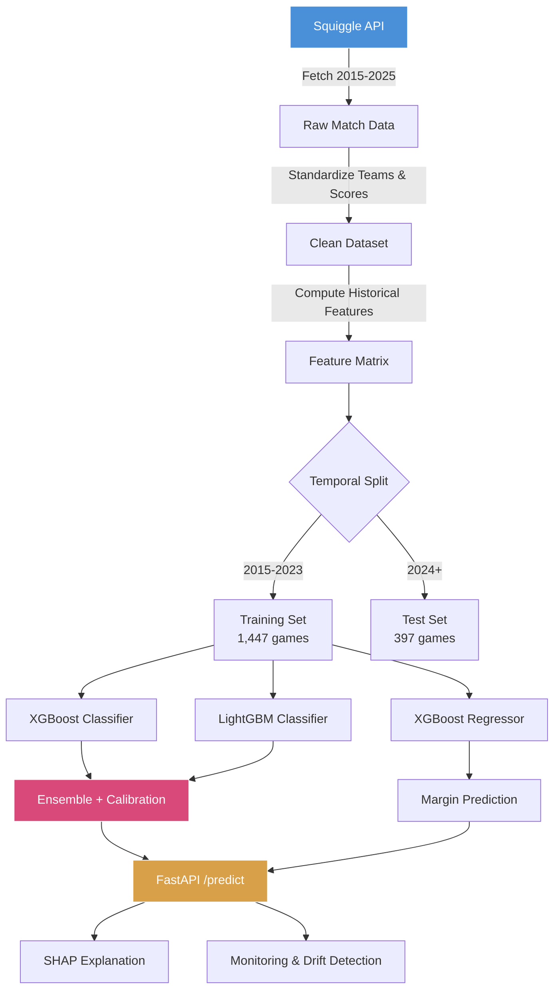
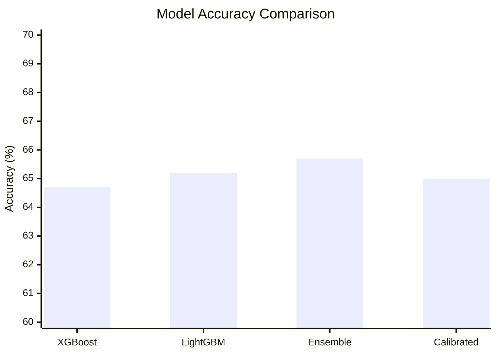
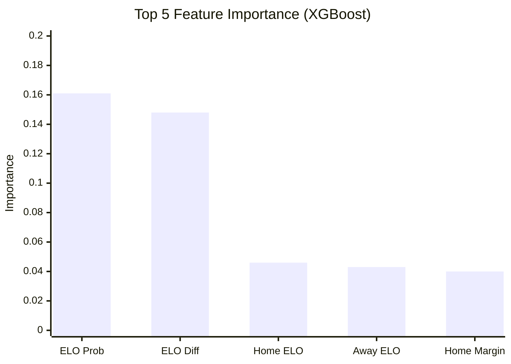
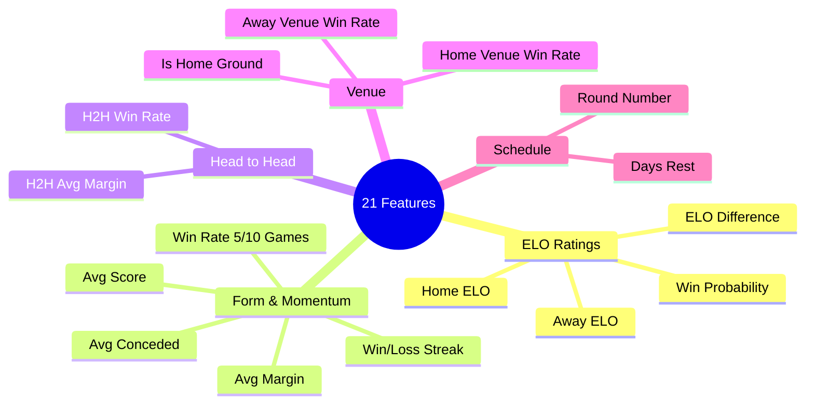

# AFL Match Outcome Predictor

A real-time machine learning prediction system for Australian Rules Football match outcomes. End-to-end ML pipeline from data collection to production API with monitoring.

## Architecture


## Pipeline Flow



## Model Performance



| Model | Accuracy | Log Loss | Brier Score |
|-------|----------|----------|-------------|
| XGBoost | 64.7% | 0.600 | 0.210 |
| LightGBM | 65.2% | 0.577 | 0.199 |
| **Ensemble** | **65.7%** | **0.585** | **0.203** |
| Calibrated | 65.0% | 0.602 | 0.208 |

> Baseline (always predict home team): ~57%. Our ensemble beats baseline by **8.7 percentage points**.

## Feature Importance



## Results

- **65.7% accuracy** on 397 held-out test games (temporal split: train 2015-2023, test 2024+)
- Beats the home-team baseline (57%) by **8.7 percentage points**
- **Log loss 0.585** vs 0.693 for random guessing — predicted probabilities carry real information
- **Brier score 0.203** vs 0.25 for random — well-calibrated probability estimates
- Top predictive features: ELO win probability, ELO difference, team ELO ratings
- All features pass leakage checks (no feature has |r| > 0.95 with the target)

## Quick Start

```bash
# Clone & setup
git clone https://github.com/EmberZz-dev/afl-predict.git
cd afl-predict
python -m venv .venv && source .venv/bin/activate
pip install -r requirements.txt

# Run the full pipeline
python -m src.data.collect      # Fetch AFL data from Squiggle API
python -m src.data.clean        # Clean & standardize
python -m src.features.build    # Engineer 21 features
python -m src.models.train      # Train XGBoost + LightGBM ensemble

# Start the API
uvicorn src.api.main:app --reload
# Open http://localhost:8000/docs
```

### Dashboard

```bash
streamlit run dashboard.py
# Open http://localhost:8501
```

Features:
- **Round Predictions** — win probabilities for every upcoming match
- **Season Simulation** — Monte Carlo ladder prediction with finals/premiership probabilities
- **Model Performance** — live accuracy tracking on 2026 results
- **One-click Retrain** — re-fetches data and retrains models from the sidebar

### Docker

```bash
docker build -t afl-predict .
docker run -p 8000:8000 afl-predict
```

## Project Structure

```
afl-predict/
├── src/
│   ├── data/
│   │   ├── collect.py          # Squiggle API data collection
│   │   └── clean.py            # Data cleaning & standardization
│   ├── features/
│   │   └── build.py            # ELO, form, H2H, venue features
│   ├── models/
│   │   ├── train.py            # Model training & evaluation
│   │   └── predict.py          # Inference + SHAP explanations
│   ├── api/
│   │   ├── main.py             # FastAPI application
│   │   └── schemas.py          # Pydantic request/response models
│   ├── monitoring/
│   │   └── tracker.py          # Prediction logging & drift detection
│   └── simulator/
│       └── season.py           # Monte Carlo season & ladder simulation
├── tests/
│   ├── test_features.py        # Feature engineering & leakage tests
│   ├── test_api.py             # API endpoint tests (25 tests)
│   ├── test_clean.py           # Data cleaning & team name tests
│   └── test_tracker.py         # Monitoring & drift detection tests
├── notebooks/
│   ├── 01_eda.ipynb             # Exploratory data analysis
│   ├── 02_features.ipynb        # Feature analysis & correlation
│   ├── 03_model_v1.ipynb        # Model training & evaluation
│   ├── 04_calibration.ipynb     # Calibration & model improvement
│   └── 05_explanations.ipynb    # SHAP explanations & monitoring
├── docs/
│   └── methodology.md          # Detailed methodology write-up
├── data/                       # Raw & processed datasets (gitignored)
├── models/saved/               # Trained model artifacts (gitignored)
├── dashboard.py               # Streamlit dashboard (season simulation)
├── Dockerfile
├── requirements.txt
└── README.md
```

## Features Engineered



## API Endpoints

| Method | Endpoint | Description |
|--------|----------|-------------|
| `POST` | `/predict` | Predict match outcome with probabilities |
| `GET` | `/teams` | All 18 AFL teams with current ELO ratings |
| `GET` | `/model/info` | Model metadata & test set performance |
| `GET` | `/model/features` | Feature importance rankings |
| `POST` | `/explain` | SHAP explanation for a prediction |
| `GET` | `/health` | API health check |
| `GET` | `/monitor/accuracy` | Rolling accuracy & drift status |

### Example Request

```bash
curl -X POST http://localhost:8000/predict \
  -H "Content-Type: application/json" \
  -d '{"home_team": "Carlton", "away_team": "Richmond", "venue": "MCG", "round_number": 5}'
```

### Example Response

```json
{
  "home_team": "Carlton",
  "away_team": "Richmond",
  "home_win_probability": 0.62,
  "away_win_probability": 0.38,
  "predicted_margin": 14.3,
  "confidence": "medium",
  "top_features": [
    {"feature": "elo_diff", "contribution": 0.18},
    {"feature": "home_form_5", "contribution": 0.12},
    {"feature": "home_venue_win_rate", "contribution": 0.09}
  ]
}
```

## Notebooks

| Notebook | Description |
|----------|-------------|
| `01_eda.ipynb` | Exploratory data analysis — score distributions, home advantage, venue effects |
| `02_features.ipynb` | Feature analysis — ELO evolution, correlation matrix, leakage checks |
| `03_model_v1.ipynb` | Model comparison — baselines, confusion matrices, ROC curves, error analysis |
| `04_calibration.ipynb` | Platt vs isotonic calibration, reliability diagrams, interaction features |
| `05_explanations.ipynb` | SHAP summary/dependence/waterfall plots, rolling accuracy monitoring |

## Testing

```bash
python -m pytest tests/ -v
```

56 tests covering:
- **API endpoints** (25 tests) — all 7 endpoints, error handling, validation
- **Feature engineering** (8 tests) — ELO calculations, data leakage prevention
- **Data cleaning** (13 tests) — team name standardisation, round number parsing
- **Monitoring** (10 tests) — prediction logging, drift detection, accuracy reports

## Tech Stack

| Layer | Technologies |
|-------|-------------|
| **Data** | pandas, requests, Squiggle API |
| **ML** | scikit-learn, XGBoost, LightGBM, SHAP |
| **API** | FastAPI, Pydantic, uvicorn |
| **Monitoring** | Custom drift detector, matplotlib |
| **Testing** | pytest, FastAPI TestClient |
| **Deployment** | Docker, uvicorn |

## Methodology

See [docs/methodology.md](docs/methodology.md) for detailed explanation of:
- Feature engineering decisions and rationale
- ELO rating system design (K-factor, home advantage, season regression)
- Temporal train/test split (no data leakage)
- Model selection and hyperparameter tuning
- Probability calibration (Platt scaling)
- Evaluation framework and metrics

## License

MIT
