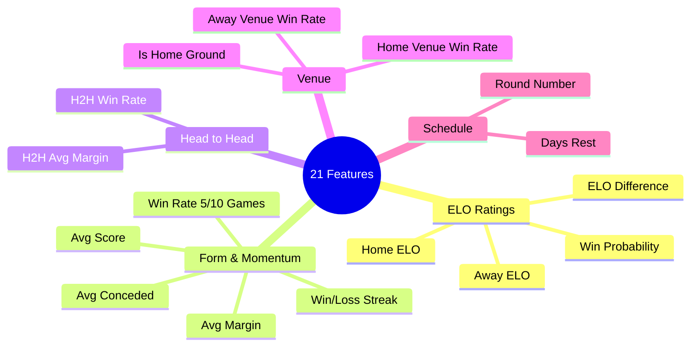

# AFL Match Predictor

A machine learning-powered web app that predicts AFL match outcomes, simulates the season ladder, and ranks teams using ELO ratings.

**[Live Demo](https://afl-predict.onrender.com)** (may take ~30s to wake up on free tier)


---

## What Does It Do?

- **Match Predictions** — Predicts which team will win each AFL match with win probabilities
- **ELO Rankings** — Live power rankings for all 18 AFL teams based on match results
- **Season Simulator** — Runs thousands of simulated seasons to predict the final ladder, finals chances, and premiership odds
- **Model Explainability** — Shows which factors (ELO, form, venue) most influence each prediction using SHAP

---

## Getting Started

### Prerequisites

You just need **Python 3.10+** installed. Check by running:

```bash
python --version
```

If you don't have Python, download it from [python.org](https://www.python.org/downloads/).

### Installation

1. **Download the project**

```bash
git clone https://github.com/EmberZz-dev/afl-predict.git
cd afl-predict
```

2. **Create a virtual environment** (keeps dependencies isolated)

```bash
python -m venv .venv
```

3. **Activate the virtual environment**

- **Mac/Linux:**
  ```bash
  source .venv/bin/activate
  ```
- **Windows:**
  ```bash
  .venv\Scripts\activate
  ```

4. **Install dependencies**

```bash
pip install -r requirements.txt
```

5. **Start the app**

```bash
uvicorn src.api.main:app --reload
```

6. **Open in your browser**

Go to [http://localhost:8000](http://localhost:8000) — that's it!

> The app comes with pre-trained models and data, so you can start using it right away.

---

### Want to Retrain the Models?

If you want to rebuild everything from scratch with the latest data:

```bash
python -m src.data.collect      # Fetch match data from the AFL API
python -m src.data.clean        # Clean & standardize team names
python -m src.features.build    # Calculate ELO ratings, form, etc.
python -m src.models.train      # Train the prediction models
```

Then restart the app with `uvicorn src.api.main:app --reload`.

---

### Using Docker (Alternative)

If you prefer Docker:

```bash
docker build -t afl-predict .
docker run -p 8000:8000 afl-predict
```

Then open [http://localhost:8000](http://localhost:8000).

---

## How It Works


1. **Data** — Collects 2,258 matches (2015–2025) from the Squiggle API
2. **Features** — Engineers 21 predictive features including custom ELO ratings, recent form, head-to-head records, and venue effects
3. **Models** — Trains an XGBoost + LightGBM ensemble with probability calibration
4. **Predictions** — Serves predictions via a FastAPI backend with a modern web frontend

### Model Performance

| Model | Accuracy | Log Loss | Brier Score |
|-------|----------|----------|-------------|
| XGBoost | 64.7% | 0.600 | 0.210 |
| LightGBM | 65.2% | 0.577 | 0.199 |
| **Ensemble** | **65.7%** | **0.585** | **0.203** |

> Home-team baseline is ~57%. Our model beats that by **8.7 percentage points**.

### Features Engineered



---

## API Endpoints

The app also has a REST API you can use programmatically. Full interactive docs at [http://localhost:8000/docs](http://localhost:8000/docs).

| Method | Endpoint | Description |
|--------|----------|-------------|
| `POST` | `/predict` | Predict a match outcome |
| `GET` | `/teams` | All 18 teams with ELO ratings |
| `GET` | `/elo/ladder` | ELO power rankings |
| `GET` | `/fixture/{year}` | Full season fixture |
| `GET` | `/round/{year}/{round}/predictions` | Predictions for a round |
| `POST` | `/simulate` | Monte Carlo season simulation |
| `POST` | `/explain` | SHAP explanation for a prediction |
| `GET` | `/model/info` | Model metrics |
| `GET` | `/health` | Health check |

### Example

```bash
curl -X POST http://localhost:8000/predict \
  -H "Content-Type: application/json" \
  -d '{"home_team": "Carlton", "away_team": "Richmond", "venue": "MCG", "round_number": 5}'
```

---

## Project Structure

```
afl-predict/
├── src/
│   ├── data/           # Data collection & cleaning
│   ├── features/       # ELO, form, H2H, venue feature engineering
│   ├── models/         # Model training & prediction
│   ├── api/            # FastAPI app & schemas
│   ├── monitoring/     # Drift detection & accuracy tracking
│   └── simulator/      # Monte Carlo season simulation
├── static/             # Website (HTML, CSS, JS)
├── models/saved/       # Pre-trained model files
├── data/processed/     # Processed datasets
├── notebooks/          # Jupyter analysis notebooks (EDA → SHAP)
├── tests/              # 56 pytest tests
├── Dockerfile
├── requirements.txt
└── README.md
```

## Testing

```bash
python -m pytest tests/ -v
```

56 tests covering API endpoints, feature engineering, data cleaning, and monitoring.

---

## Tech Stack

| Layer | Technologies |
|-------|-------------|
| **Data** | pandas, Squiggle API |
| **ML** | XGBoost, LightGBM, scikit-learn, SHAP |
| **API** | FastAPI, Pydantic, uvicorn |
| **Frontend** | HTML, CSS, JavaScript |
| **Deployment** | Docker, Render |

## License

MIT
